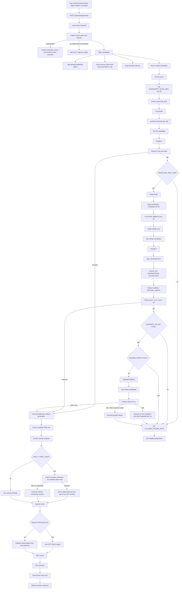

# Fallback Structure Diagram

This diagram shows the current fallback flow for `/api/articles/generate`.

## Additional Fallback Points

- YouTube cookies:
  - If `YT_COOKIES_BASE64` is missing, yt-dlp runs without a cookiefile.
  - If the decoded cookie file is not Netscape format, the cookiefile is not passed to yt-dlp.

- Failure caching:
  - Video-level failures are cached in `FailedTranscript`.
  - Provider-level failures such as Supadata `429` are not used to blacklist a video.

- Supadata:
  - Used only after Fast Mode and yt-dlp fail.
  - A single `429` activates a short in-memory cooldown and stops Supadata for that run.

- Before You Watch comments:
  - Comments are fetched only after a transcript-backed video has been selected.
  - If comments are unavailable or disabled, generation continues without community context.
  - GPT is instructed not to quote usernames or comment text directly.

- OpenAI writer:
  - If JSON parsing fails, the raw response is wrapped into a fallback article object.

- Static publishing:
  - Thumbnail download failure does not block HTML publishing.
  - Missing or invalid `articles-index.json` is recreated.

## Case-by-Case Behavior

| Case | What Happens | Result |
|---|---|---|
| No active channels | The route checks `Channel.is_active == True`. If none exist, it stops before YouTube collection. | `400` error: add active pastor channels first. |
| One channel collection fails | The failing channel is added to `collection_errors`, but other active channels continue. | Generation continues if at least one channel returns videos. |
| All channel collection fails | No candidate videos are available after trying all active channels. | `400` error with `collection_errors` diagnostics. |
| Already-used video | Videos that already have articles are skipped before scoring. | Candidate is excluded from this run. |
| Previous video-level transcript failure | Only video-level failures are skipped, such as `transcript_not_available`, `transcripts_disabled`, `video_unavailable`, or `ytdlp_no_subtitles`. | Candidate is excluded to avoid repeated bad videos. |
| Previous provider failure | Provider-level failures such as Supadata `429` are not treated as video failures. | Video can be retried later. |
| Candidate fails hard filters | The scorer rejects videos that do not meet basic content requirements. | Candidate is excluded and the reason is counted. |
| Fast Mode succeeds | `youtube-transcript-api` finds a usable transcript from the top 30 candidates. | Transcript is selected immediately; Deep Mode is skipped. |
| Fast Mode exhausts enough candidates | Fast Mode checks enough videos without success, or sees many unavailable transcripts/timeouts/provider blocks. | `should_enter_deep_mode()` returns true and Deep Mode begins. |
| Fast Mode fails but Deep Mode is not triggered | The failure threshold is not met. | Request returns `422` with fast stats only. |
| Deep Mode yt-dlp succeeds | yt-dlp inspects subtitle metadata only, selects an available caption format, fetches subtitle text, and parses it. | Transcript is selected; Supadata is skipped. |
| yt-dlp has no subtitles | yt-dlp finds no usable `subtitles` or `automatic_captions`. | Reason is counted as `ytdlp_no_subtitles`; Deep Mode may try Supadata next. |
| yt-dlp times out | yt-dlp does not finish within the deep timeout window. | Reason is counted as `ytdlp_timeout`; Deep Mode may try Supadata next. |
| yt-dlp cookie missing | `YT_COOKIES_BASE64` is not configured. | yt-dlp runs without `cookiefile`; server does not crash. |
| yt-dlp cookie invalid | The decoded cookie file does not look like Netscape cookies format. | Cookiefile is not passed to yt-dlp; log shows invalid format without leaking secrets. |
| Supadata key missing | Deep Mode reaches Supadata, but `SUPADATA_API_KEY` is not configured. | Supadata is skipped; failure response includes provider stats. |
| Supadata cooldown active | A previous `429` activated the in-memory cooldown. | Supadata is skipped for the current request. |
| Supadata returns `200` with transcript text | Supadata returns usable transcript content. | Transcript is selected with provider `supadata`. |
| Supadata returns `200` with no text | The API call succeeded, but no transcript content was available. | Counted as no transcript content; generation continues or fails depending on other providers. |
| Supadata returns `401` | API key is invalid or unauthorized. | Counted in `supadata_status_counts` and `supadata_failure_reason_counts`; server continues. |
| Supadata returns `403` | Quota, payment, or permission issue. | Counted as provider failure; server continues. |
| Supadata returns `429` | Rate limit or quota exceeded. | Supadata cooldown is activated, Supadata attempts stop for this run, and the video is not blacklisted. |
| All transcript providers fail | Fast Mode and Deep Mode fail to find usable transcript. | `422` response includes `fast_stats`, `deep_stats`, provider attempts/timeouts, Supadata status counts, and failure counts. |
| Blog or News generation | After transcript selection, Gemini analyzes the sermon, then GPT writes either blog or news based on `mode`. | Existing article generation flow continues unchanged. |
| Before You Watch generation | After transcript selection, comments are fetched only for the selected video. GPT uses transcript analysis plus aggregate comment context. | Creates a watch-guide style article that points readers to the original video. |
| Before You Watch comments unavailable | Comments are disabled, missing, API fails, or collection times out. | Generation continues without community context; response includes comment error metadata. |
| GPT returns invalid JSON | GPT response cannot be parsed as JSON. | Raw response is wrapped into a fallback article object. |
| SEO scoring | SEO scorer always returns total score, checks, and seven component scores for radar visualization. | Preview can show both `/100` and 7-axis breakdown. |
| Risk review succeeds | Risk reviewer returns risk level, status, and notes. | Article is saved with risk metadata. |
| Static thumbnail download fails during publish | Thumbnail cannot be downloaded. | HTML article still publishes without local image. |
| `articles-index.json` missing or invalid | Static publisher cannot read the existing index. | A new index object is created and publishing continues. |

## Provider Failure Categories

| Category | Meaning | Cached As Video Failure? |
|---|---|---|
| `transcript_not_available` | YouTube transcript API could not find a usable transcript. | Yes |
| `transcripts_disabled` | Captions/transcripts are disabled for the video. | Yes |
| `video_unavailable` | Video is invalid, private, removed, or unavailable. | Yes |
| `youtube_transcript_api_timeout` | Fast Mode timed out for a video. | No |
| `ytdlp_timeout` | yt-dlp timed out. | No |
| `ytdlp_no_subtitles` | yt-dlp could not find usable subtitle tracks. | Yes |
| `supadata_429` | Supadata rate limit or quota exceeded. | No |
| `supadata_error` | Supadata failed for auth, quota, timeout, malformed response, or other provider issue. | No |
| `provider_blocked` | Provider access was blocked, such as bot verification or API block. | No |
